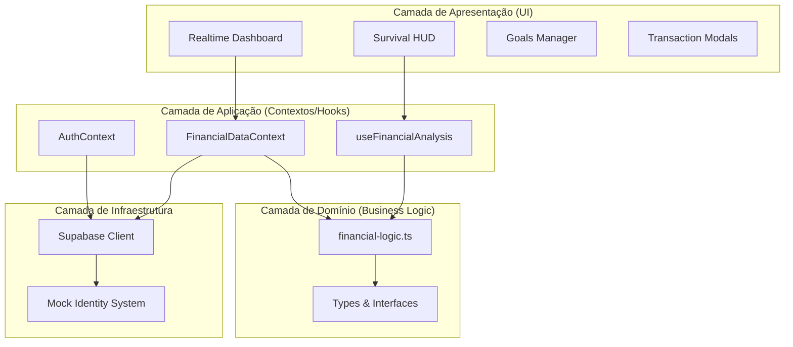

# 🗺️ Mapa Arquitetural: Finance-IA

Este diagrama ilustra como as diferentes camadas e componentes do sistema interagem entre si.

### Fluxo de Inteligência Financeira:
1. **Dados Brutos:** O `FinancialDataContext` busca dados das tabelas `accounts`, `transactions` e `goals` no Supabase.
2. **Processamento:** O hook `useFinancialAnalysis` envia esses dados para o `financial-logic.ts` (Domínio).
3. **Cálculo:** O motor calcula a liquidez líquida e decide se o usuário está em "Survival Mode".
4. **Visualização:** O `SurvivalHUD` recebe o status e muda a cor de toda a interface para alertar o usuário.
