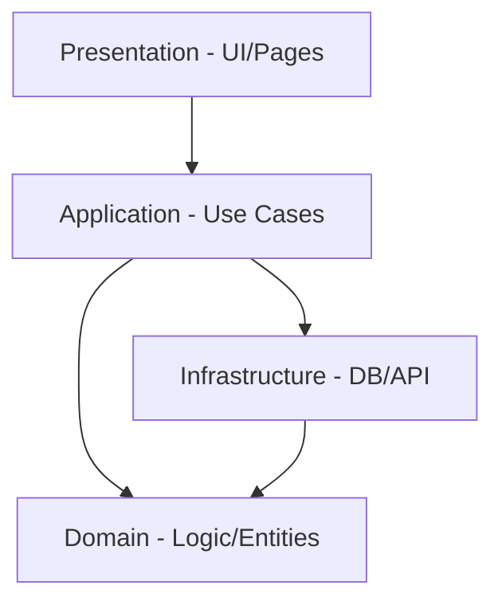

# 🏗️ Arquitetura do Sistema

O Vesper Finance utiliza uma arquitetura inspirada em **Clean Architecture** e **Hexagonal Architecture**, adaptada para a realidade de um projeto Next.js moderno. O objetivo principal é a separação de interesses (*Separation of Concerns*), garantindo que a lógica de negócio (o cálculo financeiro) seja independente de frameworks e bancos de dados.

---

## 📐 Camadas do Sistema

O fluxo de dependência é sempre de **fora para dentro**. As camadas externas podem depender das internas, mas o **Domínio** nunca conhece nada sobre o mundo exterior (como APIs ou Banco de Dados).



### 1. 📂 Domain (O Coração)
Localizada em `src/domain/`, esta camada contém a "verdade absoluta" do negócio.
*   **Entidades**: Definições de tipos e interfaces core (`Account`, `Transaction`).
*   **Regras de Negócio**: Funções puras que realizam cálculos (ex: `financial-logic.ts`).
*   **Interfaces de Repositório**: Contratos que definem como os dados devem ser salvos, sem dizer *onde* (ex: `UserRepository`).

### 2. 📂 Application (Orquestração)
Localizada em `src/application/` (ou em hooks orquestradores em projetos menores), ela coordena as ações.
*   **Use Cases**: Mapeia exatamente o que o usuário quer fazer (ex: `CreateTransaction`, `RecalculateProjections`).
*   **Diferencial**: Não contém lógica matemática; ela apenas chama as funções do Domínio e salva o resultado via Infraestrutura.

### 3. 📂 Infrastructure (Implementação)
Localizada em `src/infrastructure/` e `src/services/`.
*   **Implementações Concretas**: Onde o código fala com o **Supabase**, **Dexie.js** ou APIs externas.
*   **Persistência**: Implementação dos repositórios definidos no domínio.

### 4. 📂 Presentation (UI)
Localizada em `src/components/` e `src/app/`.
*   **Componentes**: React Components altamente visuais e interativos.
*   **Contextos**: Gerenciamento de estado global (ex: `FinancialDataContext`).
*   **Hooks**: Consomem a camada de aplicação para expor dados à UI.

---

## 💉 Padrões Obrigatórios

### Repository Pattern
Nunca acessamos o banco de dados diretamente dentro de um componente. Usamos serviços e repositórios para desacoplar a UI da fonte de dados. Isso nos permitiu, por exemplo, alternar facilmente entre o Supabase e o cache local do Dexie.

### Injeção de Dependência
Embora não usemos um container de DI complexo (como Inversify), aplicamos a injeção via construtores ou parâmetros em funções. Isso facilita absurdamente os **Mocks** em testes E2E, permitindo simular estados financeiros complexos sem tocar no banco real.

---

## 📁 Estrutura de Pastas

```bash
src/
├── app/            # Roteamento Next.js (App Router)
├── components/     # Componentes visuais (UI)
├── context/        # Providers de Context API (Estado Global)
├── domain/         # Entidades e Lógica Pura (Financeiro)
├── hooks/          # Hooks Customizados (Ponte UI-Negócio)
├── lib/            # Utilitários e instâncias (DB, Utils)
├── services/       # Clientes de API e Integrações
└── types/          # Definições de tipos TypeScript globais
```

---

> [!IMPORTANT]
> **A Regra de Ouro**: Se precisarmos trocar o Supabase pelo Firebase amanhã, o arquivo `src/domain/financial/financial-logic.ts` não deve sofrer alteração de sequer uma linha de código.
