# 🎮 Gamificação Brutalista: Resiliência Financeira Ativa

> "No Vesper, seu saldo não é um número para ostentar; é sua blindagem contra o caos."

Diferente de aplicativos financeiros tradicionais que usam mecânicas infantis de gamificação (como moedinhas digitais ou badges genéricos), a gamificação do **Vesper Finance** segue a filosofia **Premium Brutalist**. Ela é crua, focada em resiliência real, sobrevivência matemática e soberania financeira. 

Este documento especifica o design system, as mecânicas de jogo baseadas em dados e os componentes visuais para transformar a conquista de metas (Ambições) em um sistema de evolução de resiliência.

---

## 🦾 Conceito Central: O Escudo de Liquidez (Liquidity Armor)

O dinheiro acumulado em metas e contas de liquidez não é apenas poupança; é tratado como **Imunidade Financeira**. A mecânica principal gira em torno de medir quantos meses de custo de vida o usuário consegue sobreviver caso sua renda primária zere hoje.

### Os Tiers de Sobrevivência (Antifragilidade)

O sistema calcula dinamicamente o **Tier de Antifragilidade** do usuário com base no cálculo:
$$\text{Meses de Sobrevivência} = \frac{\text{Liquidez Líquida Real}}{\text{Custo Fixo Mensal}}$$

| Nível (Tier) | Nome do Tier | Requisito | Comportamento da UI |
| :--- | :--- | :--- | :--- |
| **Tier 0** | 💀 **Zona de Oxigênio (Modo Crise)** | Liquidez Líquida $< 0$ | Interface vermelha intermitente, HUD bloqueia metas de consumo e foca 100% no *Fundo de Emergência*. |
| **Tier 1** | 🛡️ **Sobrevivente** | $0 \le \text{Meses} < 3$ | Estilo industrial cinza e violeta. Metas básicas liberadas, foco em consolidar respiro de curto prazo. |
| **Tier 2** | ⚡ **Imune** | $3 \le \text{Meses} < 6$ | Acentos esmeralda e neon. O HUD libera "Ambições de Médio Prazo" (ex: viagens, compras maiores). |
| **Tier 3** | 🔮 **Antifrágil** | $\text{Meses} \ge 6$ | Interface Premium Ouro e Obsidian. Acesso total a simulações de alto rendimento e metas de investimento de longo prazo. |

---

## 🎯 Mecânicas de Gamificação para Metas (Ambições)

### 1. O Algoritmo de Congelamento de Ambições
Para proteger o usuário contra a ilusão de consumo em períodos de crise, o Vesper introduz o **Lockout de Meta**. 

- **Gatilho**: Se a Liquidez Líquida cair abaixo de zero (Modo Crise), todas as metas que não sejam da categoria `Fundo de Emergência` são congeladas.
- **Efeito Visual**: O card da meta na UI é sobreposto por uma grade cinza semitransparente com um aviso brutalista:
  > **⚠️ META CONGELADA**
  >
  > *Seu oxigênio financeiro está abaixo do nível crítico. O motor de simulação bloqueou aportes nesta meta para preservar sua sobrevivência.*

### 2. Streaks de Consistência (Sobra Livre)
Em vez de premiar apenas o valor aportado, o Vesper premia a **consistência matemática**.

- **Multiplicador de Streak**: Cada mês consecutivo em que o usuário consome menos do que o **Teto de Sobrevivência Semanal** adiciona $+1$ ao multiplicador de consistência.
- **Visual Feedback**: Um indicador de chamas neon discretas no HUD superior (`x3 Months Saved`). 
- **Recompensa Física**: Ao atingir streaks de 6 meses, o usuário desbloqueia temas visuais exclusivos para a plataforma (ex: *Acid Obsidian*, *Cyberpunk Amber*).

### 3. Rachaduras do Cartão (Card Overload)
Quando a proporção de dívidas do cartão de crédito excede 50% dos ativos líquidos, a interface do HUD começa a sofrer distorções visuais (efeitos de ruído/rachadura digital em CSS) na seção do cartão de crédito, gerando uma urgência psicológica de quitar a fatura.

---

## 🎨 Componentes da Interface (UI Premium Brutalist)

### 1. Roda de Resiliência (The Resilience Matrix)
Substituindo os gráficos de pizza tradicionais, a Roda de Resiliência é um círculo concêntrico segmentado em blocos brutalistas, simulando um medidor de pressão ou reator industrial.

```mermaid
graph TD
    A[Roda de Resiliência] --> B[Anel Interno: Sobra Mensal]
    A --> C[Anel Central: Fundo de Emergência]
    A --> D[Anel Externo: Projeção de Metas a Longo Prazo]
    style A fill:#0d0d0d,stroke:#fff,stroke-width:2px;
    style B fill:#10b981,stroke:#000,stroke-width:1px;
    style C fill:#8b5cf6,stroke:#000,stroke-width:1px;
```



### 2. Achievement Grid (Grelha de Soberania)
Um grid na página de metas que mostra conquistas desbloqueadas como chaves disjuntoras industriais que se "conectam" (ficam verdes) quando ativas.

*   🔌 **"Primeira Alforria"**: Ter todas as faturas futuras de cartão zeradas em simulação por 3 meses.
*   🔋 **"Bateria Carregada"**: Atingir 100% da meta de Fundo de Emergência.
*   📡 **"Sonar de Impacto"**: Usar o Spending Simulator 5 vezes antes de efetuar compras de alto valor.

---

## 💾 Modelagem de Banco de Dados (Supabase)

Para persistir o estado de gamificação local-first com sincronização remota, adicionamos o seguinte esquema na infraestrutura de dados:

```sql
-- supabase/migrations/migration_gamification.sql

CREATE TABLE public.user_gamification_profile (
    id UUID PRIMARY KEY DEFAULT gen_random_uuid(),
    user_id UUID NOT NULL REFERENCES auth.users(id) ON DELETE CASCADE,
    resilience_points INTEGER DEFAULT 0 NOT NULL,
    current_streak INTEGER DEFAULT 0 NOT NULL,
    max_streak INTEGER DEFAULT 0 NOT NULL,
    active_theme VARCHAR(50) DEFAULT 'brutalist-dark' NOT NULL,
    unlocked_achievements JSONB DEFAULT '[]'::jsonb NOT NULL,
    created_at TIMESTAMPTZ DEFAULT now() NOT NULL,
    updated_at TIMESTAMPTZ DEFAULT now() NOT NULL
);

-- Trigger para atualizar timestamps
CREATE TRIGGER handle_updated_at_gamification
    BEFORE UPDATE ON public.user_gamification_profile
    FOR EACH ROW
    EXECUTE FUNCTION public.handle_updated_at();
```

---

## 🧪 Estratégia de Testes para Gamificação

Para garantir a blindagem dessa mecânica no Playwright, adicionamos as seguintes asserções determinísticas na nossa suíte de testes E2E:

1.  **Testar Lockout de Metas na Crise**:
    - *Ação*: Injetar uma transação de débito massiva via Mock que jogue a liquidez líquida para negativo.
    - *Resultado Esperado*: Acessar a página `/goals` e verificar se a classe `.goal-frozen-overlay` está visível e o botão de aporte está desabilitado.
2.  **Testar Evolução de Tiers**:
    - *Ação*: Aportar fundos simulados até que o cálculo de meses de sobrevivência atinja 6 meses.
    - *Resultado Esperado*: O cabeçalho deve exibir o badge `Antifrágil` com animações em esmeralda.
