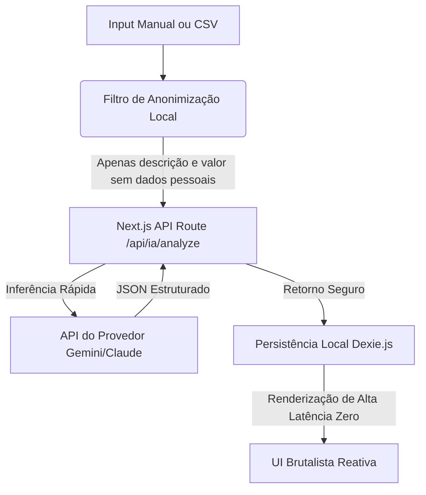

# 🤖 Arquitetura de Integração de IA Soberana: Vesper Finance

Este documento estabelece o plano de integração de Inteligência Artificial no ecossistema do Vesper Finance. Alinhado com a nossa filosofia **brutalista, minimalista, de alta utilidade e zero desperdício de atenção**, a IA não deve ser um chat de conversação genérico, mas sim um **motor analítico de causalidade invisível operando em segundo plano**.

---

## 🔑 1. Configuração do Ambiente (.env)

Para viabilizar a integração sem custos inflados de infraestrutura e com latência ultra-baixa, o sistema consumirá chaves de API padrão diretamente nas rotas seguras do Next.js (`src/app/api/`):

```env
# Provedor de IA de Baixo Custo e Baixíssima Latência (Recomendado: Gemini 1.5 Flash ou Claude 3.5 Haiku)
GEMINI_API_KEY="sua_chave_aqui"
```

Toda a inferência é feita via **Serverless API Routes** no Next.js, mantendo a chave API 100% oculta do cliente e preservando a segurança. Os resultados são cacheados localmente no **Dexie.js** para garantir a experiência offline-first.

---

## 🎯 2. Dois Casos de Uso Pragmatizados (Zero Atrito & Alto Valor)

Para evitar o "megazord conceitual", focamos exclusivamente em duas integrações de IA sóbrias que respeitam a agência do usuário e resolvem problemas práticos de alta utilidade:

### 1. Categorização e Triagem Inteligente Zero-Fricção (Extrato Autônomo)
*   **O Problema**: A principal causa de abandono de apps de finanças é o trabalho manual e enfadonho de triar e categorizar cada transação (ex: *"Zaffari Higienópolis é Alimentação, Lazer ou Saúde?"*).
*   **Como a IA Resolve**: Ao importar dados via CSV/OFX ou ao digitar uma descrição rápida, a IA traduz o texto sujo da fatura bancária em dados estruturados com alta precisão e sem fricção.
*   **O Retorno da IA (JSON Estruturado)**:
    *   *Input do usuário*: `"uber trip sabado a noite 45"`
    *   *Saída do Motor*:
        ```json
        {
          "description": "Corrida Uber (Sábado)",
          "amount_cents": 4500,
          "category": "TRANSPORT",
          "is_variable_expense": true,
          "recurring_prediction": "none"
        }
        ```
*   **Por que combina**: Reduz o atrito operacional a zero, mantendo o banco de dados e os orçamentos semanais sempre perfeitamente atualizados.

### 2. Conselheiro Híbrido de Priorização de Metas (IA Copiloto)
*   **A Dúvida Estratégica**: *A priorização automática remove a soberania e a agência do usuário. A priorização 100% manual pode deixá-lo cego em relação a gargalos matemáticos de sobrevivência.*
*   **A Solução Híbrida do Vesper**: O controle é **absolutamente manual e soberano** (o usuário arrasta e ordena suas metas como preferir). Contudo, a IA atua silenciosamente como uma **Consultoria Estratégica e Analista de Riscos em tempo real**:
    *   **Auditoria de Fila**: Se o usuário prioriza um gasto de consumo supérfluo (ex: "Trocar de TV") enquanto sua Reserva de Emergência está criticamente desabastecida, a IA emite uma recomendação visual sutil ao lado da meta:
        > `⚠️ Recomendação IA: Inverter ordem com 'Ambição de Emergência' para reestabelecer o Escudo de Sobrevivência primeiro. Isso reduz o prazo geral das metas em 38 dias.`
    *   **Botão Opcional "Otimizar com IA"**: Adicionamos um botão sutil no painel de metas. Ao clicar, a IA sugere temporariamente uma fila matematicamente ideal (com base em taxas de juros de dívidas ativas, liquidez atual e metas sequenciadas). O usuário visualiza o "antes e depois" e escolhe manualmente **Aceitar** ou **Rejeitar** a proposta.
*   **Por que combina**: Preserva 100% a agência e o controle soberano do usuário, ao mesmo tempo em que elimina a cegueira de planejamento, fornecendo insights numéricos frios e práticos.

---

## 🏛️ 3. Arquitetura de Fluxo de Dados (Offline-First Preservado)

A privacidade e a velocidade são leis no Vesper. O fluxo de IA segue o diagrama abaixo:



1.  **Privacidade Absoluta**: Dados pessoais sensíveis (como nome, CPF, e-mail ou saldos reais de contas) **nunca** são transmitidos para a API externa de IA. Enviamos apenas descrições de transações isoladas para categorização ou taxas e prazos genéricos para simulação de metas.
2.  **Velocidade Local-First**: A IA processa dados apenas no momento da entrada ou sob demanda direta (ex: ao clicar em "Otimizar"). Uma vez salvos no **IndexedDB** local, as projeções matemáticas continuam rodando via TypeScript nativo no cliente com **latência zero**, sem nenhuma chamada externa lenta.
