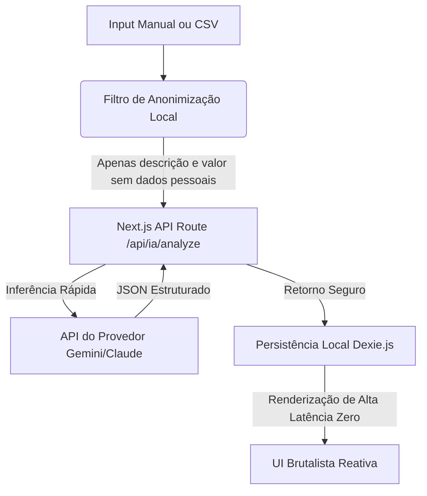

# 🤖 Arquitetura de Integração de IA Soberana: Vesper Finance

Este documento estabelece o plano de integração de Inteligência Artificial no ecossistema do Vesper Finance. Alinhado com a nossa filosofia **brutalista, minimalista, de alta utilidade e zero desperdício de atenção**, a IA não deve ser um chat de conversação genérico, mas sim um **motor analítico de causalidade invisível operando em segundo plano**.

---

## 🔑 1. Configuração do Ambiente (.env)

Para viabilizar a integração sem custos inflados de infraestrutura e com latência ultra-baixa, o sistema consumirá chaves de API padrão diretamente nas rotas seguras do Next.js (`src/app/api/`):

```env
# Provedor de IA de Baixo Custo e Alta Latência (Recomendado: Gemini 1.5 Flash ou Claude 3.5 Haiku)
GEMINI_API_KEY="sua_chave_aqui"
# Ou alternativamente para processamento de linguagem
OPENAI_API_KEY="sua_chave_aqui"
```

Toda a inferência é feita via **Serverless API Routes** no Next.js, mantendo a chave API 100% oculta do cliente e preservando a segurança. Os resultados são cacheados localmente no **Dexie.js** para garantir a experiência offline-first.

---

## 🎯 2. Três Casos de Uso Pragmatizados (Zero Atrito & Alto Valor)

Para evitar o "megazord conceitual", focamos exclusivamente em três integrações que combinam com o Vesper, reduzem o trabalho manual do usuário e oferecem precisão cirúrgica:

### 1. Categorização e Triagem Inteligente Zero-Fricção (Extrato Autônomo)
*   **O Problema**: A principal causa de abandono de apps financeiros é o atrito de categorizar transações manualmente (ex: *"Zaffari Higienópolis é Alimentação, Lazer ou Saúde?"*).
*   **Como a IA Resolve**: Ao importar dados via CSV, arquivo OFX ou ao digitar uma descrição livre rápida no input, a IA traduz o texto sujo da fatura em dados limpos de banco de dados.
*   **O Retorno da IA (JSON Estruturado)**:
    *   *Input do usuário*: `"uber trip sabado a noite 45"`
    *   *Saída do Motor*:
        ```json
        {
          "description": "Corrida Uber (Sábado)",
          "amount_cents": 4500,
          "category": "TRANSPORT",
          "is_variable_expense": true,
          "recurring_prediction": "none"
        }
        ```
*   **Por que combina**: Mantém os orçamentos (*Budgets*) do usuário 100% atualizados sem exigir que ele clique em telas e selecione categorias para cada gasto.

### 2. O Tradutor de Consequências "What If" (Simulador via Linguagem Natural)
*   **O Problema**: Configurar parcelamentos complexos com taxas ou entradas no Spending Simulator manual exige lidar com muitos sliders, inputs e formulários poluídos.
*   **Como a IA Resolve**: Substituímos os campos complexos por uma única **barra de texto brutalista inteligente** no Spending Simulator. O usuário digita o seu plano de consumo em linguagem natural.
*   **Exemplos de Inputs Práticos**:
    *   > *"Quero simular a compra de um notebook de R$ 8.000 parcelado em 10x no cartão."*
    *   > *"Se eu der R$ 5.000 de entrada e financiar o restante de R$ 15.000 em 12x?"*
*   **Como Funciona**: A Rota de IA no Next.js quebra a sentença em parâmetros numéricos puros (`amount_cents`, `installments`, `down_payment`) e os injeta instantaneamente no motor matemático nativo do **Impact Radius**. A tela se atualiza reativamente, renderizando o "raio de dano" no futuro do usuário.

### 3. Motor Preditivo de Fuga de Capital (Vazamento de Caixa)
*   **O Problema**: O usuário consome a sua sobra financeira em pequenas despesas variáveis invisíveis ao longo do mês e só percebe o estrago quando o saldo entra no vermelho.
*   **Como a IA Resolve**: Um job leve e silencioso no background do Next.js analisa a correlação temporal de despesas variáveis e projeta a data exata do colapso de caixa com semanas de antecedência.
*   **Como o Insight é Exibido (Linguagem Brutalista Fria)**:
    *   Em vez de usar mensagens de incentivo ou conselhos terapêuticos de finanças, o sistema cospe um log analítico sutil no rodapé do Dashboard:
        > `[⚠️ ALERTA IA: FUGA DE CAPITAL DETECTADA]`
        > 
        > *Padrão de consumo em Lazer Variável nos últimos 3 finais de semana projeta colapso do saldo operacional em 18 de Setembro. Limite semanal recomendado ajustado de R$ 300 para R$ 190 para preservar o Escudo de Sobrevivência.*
*   **Por que combina**: Alinha-se diretamente com o **SurvivalHUD** e a busca do Vesper pela verdade matemática nua e crua.

---

## 🏛️ 3. Arquitetura de Fluxo de Dados (Offline-First Preservado)

A privacidade e a velocidade são leis no Vesper. O fluxo de IA segue o diagrama abaixo:



1.  **Privacidade Absoluta**: Dados como nome de usuário, saldos totais de contas bancárias ou e-mails **nunca** são enviados para a API de IA. Enviamos apenas strings de texto de transações para classificação ou valores numéricos isolados para projeções.
2.  **Velocidade**: A IA categoriza as transações na entrada. Uma vez gravadas no **Dexie.js** local, toda a renderização posterior de gráficos, orçamentos e projeções roda com **latência zero** utilizando as funções puras em TypeScript, sem depender de chamadas lentas de IA a cada render.
