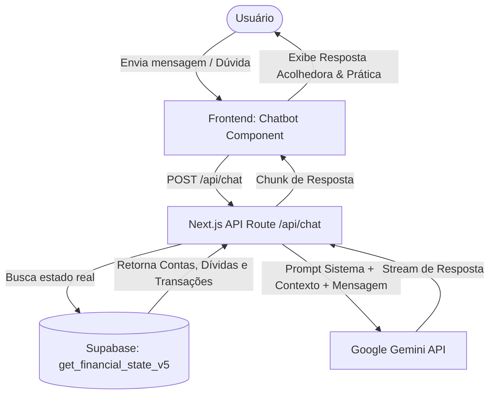

# ADR-006: Chatbot de IA Financeira do Vesper (Vesper AI Copilot)

**Status:** Aprovado
**Data:** 17/05/2026

## Contexto
O usuário se encontra em uma situação financeira de altíssima vulnerabilidade e estresse pós-desemprego, acumulando passivos significativos de cartão de crédito e necessitando de suporte para cobrir custos básicos de sobrevivência (como itens de higiene e limpeza). O sistema atual do Vesper calcula e exibe métricas financeiras com alta precisão (HUD de Sobrevivência, Time Machine), mas carece de uma interface conversacional inteligente que ajude o usuário a tomar decisões estratégicas complexas sob pressão, como:
- Como alocar o limite de crédito restante para despesas básicas de subsistência.
- O custo-benefício de operações como Pix Parcelado e pagamento de contas com cartão de crédito (estratégias de rolagem de dívida).
- Um plano de ação empático, sem julgamentos, focado na recuperação de liquidez e na preparação para resgatar recursos futuros (ex: FGTS).

## Decisão
Implementaremos o **Vesper AI Copilot**, um assistente conversacional inteligente integrado diretamente ao dashboard do sistema. A arquitetura será baseada nos seguintes pilares:

### 1. Injeção de Contexto Financeiro em Tempo Real (RAG Local)
Para evitar respostas genéricas e ineficazes, a IA precisa de contexto absoluto.
- O endpoint `/api/chat` buscará o estado financeiro consolidado do usuário no banco de dados (contas, transações recentes, faturas de cartões com datas de fechamento/vencimento, fluxos recorrentes e orçamentos) usando a RPC otimizada `get_financial_state_v5`.
- Este payload de dados estruturados será injetado no prompt de sistema (System Instruction) de forma compacta e segura.

### 2. Integração com a API do Gemini (Next.js Edge Route)
- Utilizaremos a API do Google Gemini (Gemini 2.5 Flash para respostas rápidas e baixo custo, ou Gemini 2.5 Pro para raciocínio financeiro profundo).
- O backend operará em modo Streaming para entregar respostas instantâneas, melhorando a experiência do usuário.

### 3. Diretrizes de Empatia e Tom de Voz (System Prompt Guardrails)
O assistente será configurado com uma persona específica de **Mentor de Sobrevivência Financeira (Survival Mentorship)**:
- **Linguagem:** Português do Brasil (pt-BR), natural, informal, acolhedor, transparente e direto ao ponto.
- **Empatia Radical:** Sem sermões moralistas ou críticas a gastos impulsivos passados. Foco absoluto no presente e nas soluções viáveis de curto prazo.
- **Análise de Engenharia Financeira de Crise:** Capacidade de calcular cenários de rolagem de dívida (ex: taxa de juros do Pix parcelado vs. juros do rotativo de cartão) e aconselhar sobre estratégias de sobrevivência (ex: priorização de alimentação/moradia sobre pagamento integral de faturas não essenciais).
- **Sem Ilusões:** Ser honesto sobre o custo de "maracutaias" financeiras, alertando claramente sobre taxas abusivas, mas ajudando o usuário a escolher a opção menos prejudicial para manter a dignidade no dia a dia.

### 4. UI/UX: HUD Premium Conversacional
- **Acesso Rápido:** Um balão flutuante minimalista ou painel expansível no canto inferior direito do Dashboard.
- **Estética:** Design consistente com o Vesper (Glassmorphism, dark mode, bordas arredondadas de `3xl`, blur de fundo e micro-animações com Framer Motion).
- **Sugestões Rápidas:** Botões com perguntas predefinidas baseadas no estado financeiro atual do usuário (ex: *"Como comprar mantimentos básicos este mês?"*, *"O que acontece se eu pagar o mínimo do Nubank?"*, *"Como sair do vermelho com meu salário atual?"*).

## Consequências
- **Prós:**
  - Transforma o Vesper de um visualizador de dados passivo em um consultor financeiro ativo e estratégico de altíssimo valor.
  - Oferece suporte emocional e prático direto em momentos de estresse agudo.
  - Alinhado com a identidade de inteligência artificial da plataforma.
- **Contras:**
  - Custo incremental de chamadas de API do Gemini (minimizado pelo uso de modelos eficientes como o Gemini 2.5 Flash).
  - Necessidade de implementar guardrails rígidos para deixar claro que a IA é um assistente de apoio à decisão, e não um consultor de investimentos ou garantia de eliminação de dívidas sem esforço.

## Design UI/UX do Chatbot
O componente visual do chatbot será integrado no `RealtimeDashboard.tsx` e utilizará a paleta escura do Vesper, com detalhes em roxo violeta e efeitos neon suaves para indicar o status de processamento da IA, garantindo a sensação de um sistema premium de inteligência de ponta.
