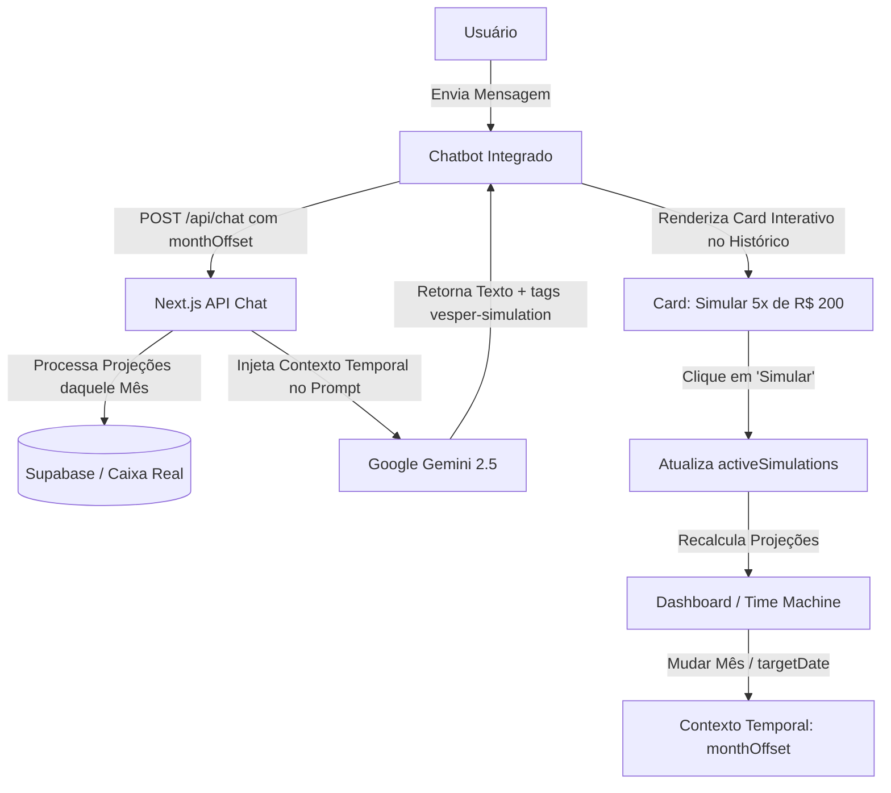

# ADR-009: Central de Inteligência Conversacional Vesper AI Copilot (Modo Jarvis)

**Status:** Aprovado  
**Data:** 2026-05-28  
**Autor:** Antigravity AI  

---

## 📌 Contexto & Problema

O usuário demandou uma experiência de inteligência artificial de alta fidelidade e sem fricção na plataforma Vesper Finance. As análises de simulação anteriores (Jarvis Console, Dilema de IA) e o chatbot de suporte flutuante eram desconexos das projeções temporais da Time Machine. O usuário deseja poder fazer perguntas sobre o contexto futuro (ex: *"Quanto vou precisar pegar emprestado no mês de Junho?"*), interagir com a IA diretamente e assistir à reconfiguração automática das metas e do caixa do Dashboard de forma visual e inovadora.

---

## 📐 Decisão Arquitetural & Técnica

Optamos por implementar a **Central de Inteligência Vesper AI Copilot como o 'Modo Jarvis' integrado ao próprio Dashboard**, sincronizado dinamicamente com a Time Machine e com o estado reativo de simulações.

As decisões técnicas e de design de engenharia englobam:

### 1. Estado Reativo Integrado (`RealtimeDashboard.tsx`)
*   Adicionar um estado `isCopilotOpen` no `RealtimeDashboard.tsx` para alternar o layout de exibição da tela.
*   **Grid Dividido (Split Layout):** Se `isCopilotOpen === true`, a interface principal do Dashboard encolhe suavemente no desktop (ex: de colunas `md:grid-cols-3` para layouts alinhados e flexíveis) e revela o painel do Copilot lateralmente (`30%` a `35%` da largura da tela).
*   Isso preserva toda a capacidade de visualização ativa do Dashboard (Time Machine, Resumo Excel, Metas e Orçamentos) enquanto o usuário conversa com a IA.

### 2. Sincronização Temporal com a Time Machine (Contexto de Viagem Temporal)
*   A interface do chat escutará ativamente a alteração de `targetDate` e `monthOffset` do Dashboard.
*   Ao mudar de mês no Dashboard, o Copilot automaticamente recebe o novo contexto orçamentário daquele período específico.
*   A requisição enviada ao endpoint `/api/chat` incluirá a propriedade `monthOffset` no corpo do payload.
*   O backend `/api/chat/route.ts` lerá a projeção do motor financeiro para aquele `monthOffset` específico (usando a mesma lógica matemática consolidada do frontend) e a injetará no prompt de sistema para que a IA dê respostas precisas e contextualizadas temporalmente.

### 3. Pílulas de Simulação Conversacional (Interactive UI Blocks)
*   Configuraremos as regras de prompt de sistema da API `/api/chat` para que, ao simular gastos, parcelamentos ou empréstimos, a IA insira metadados estruturados delimitados por `<vesper-simulation>...JSON...</vesper-simulation>`.
*   O frontend fará o parser seguro usando expressões regulares e removerá o bloco XML do texto legível, convertendo-o em um **Card de Simulação Interativo** renderizado na conversa.
*   O card contará com a ação de **"Simular no Caixa"**. Clicar nessa ação chamará a função `onSimulate` do Dashboard, inserindo o objeto de simulação diretamente na cadeia reativa de projeção e atualizando instantaneamente os indicadores visuais na tela.

### 4. Persistência de Conversa no Cliente
*   Para garantir consistência e evitar a perda de histórico durante a navegação entre páginas ou recarregamentos, as mensagens do chat serão persistidas no `localStorage` do navegador sob o escopo do usuário corrente (`vesper_copilot_chat_history`).

---

## ⚖️ Consequências & Trade-offs

*   **Prós:**
    *   **Inovação Disruptiva de UX/UI:** Une conversação inteligente com visualização interativa reativa sem fricção e sem mudar de tela.
    *   **Contexto Temporal Preciso:** O usuário pode "viajar no tempo" com o Dashboard e fazer perguntas estratégicas específicas para cada mês futuro.
    *   **Design Premium Unificado:** O painel se encaixa perfeitamente no visual Glassmorphic existente do Vesper.
*   **Contras:**
    *   **Complexidade no Redimensionamento do Grid:** O grid do Dashboard precisa ser extremamente adaptável para acomodar o chat sem poluição visual. Resolveremos isso criando um design responsivo e fluido para o grid do Dashboard quando o Copilot estiver aberto.

---

## 🚦 Plano de Verificação

### 1. Testes E2E (Playwright)
*   Adicionar testes automatizados no Playwright para validar a ativação do modo Copiloto, a digitação de dilemas e a reatividade de simulação no Dashboard.
