# 🗺️ Vesper Finance: Contexto, Funcionamento e Diferenciais do Sistema

> "Não apenas conte seu dinheiro; faça seu dinheiro contar uma história sobre o seu futuro."

O **Vesper Finance** é uma plataforma disruptiva de inteligência financeira pessoal e preditiva. Diferente dos gerenciadores tradicionais de finanças que agem apenas como "diários de gastos" (reativos), o Vesper funciona como um **simulador de vida financeira (ativo e preditivo)**. Ele foi construído sob uma estética *Premium Brutalist* para usuários que demandam clareza absoluta sobre o impacto imediato e de longo prazo de cada decisão financeira.

---

## 📌 1. A Dor que o Vesper Resolve (O Problema)

Gerenciadores financeiros comuns falham porque focam no passado. Eles dizem ao usuário onde ele *gastou* dinheiro, mas não respondem à pergunta mais importante: **"Se eu comprar isto hoje, qual será o impacto real na minha vida daqui a seis meses?"**

As principais dores resolvidas pelo Vesper são:
1. **A Falsa Sensação de Riqueza**: O usuário vê R$ 5.000,00 no saldo bancário, mas ignora que possui R$ 6.000,00 em faturas futuras e parcelamentos no cartão de crédito.
2. **A Paralisia por Ansiedade Financeira**: A falta de clareza matemática sobre quando as dívidas terminarão ou quando uma meta será alcançada gera estresse constante.
3. **A Inércia das Planilhas Estáticas**: Planilhas manuais exigem disciplina extrema e não recalculam automaticamente o fluxo de caixa acumulado diante de cenários hipotéticos.

---

## ⚙️ 2. Como o Sistema Funciona (O Motor e a Mecânica)

O coração do Vesper está no seu **Motor de Projeção Dinâmica** e na sua abordagem matemática rigorosa.

```mermaid
graph TD
    A[Estado Atual: Saldo Real] --> B[Motor de Projeção: Time Machine]
    B --> C[Passo 1: Somar Rendas Ativas]
    B --> D[Passo 2: Subtrair Custos Fixos]
    B --> E[Passo 3: Deduzir Parcelas de Cartão]
    B --> F[Passo 4: Reservar Orçamentos Planejados]
    B --> G[Passo 5: Subtrair Aportes de Metas]
    G --> H[Projeção de Saldo Acumulado nos Meses Futuros]
    style A fill:#111,stroke:#fff,stroke-width:2px;
    style H fill:#10b981,stroke:#000,stroke-width:2px;
```

### 🕰️ A Máquina do Tempo (*Time Machine*)
Ao navegar pelos meses futuros, o Vesper não apenas replica valores. O algoritmo `calculateAdvancedProjection` realiza uma simulação acumulada mês a mês, considerando:
* **Transações Recorrentes**: Salários, assinaturas e despesas fixas.
* **Parcelamentos**: A alocação exata de parcelas futuras nos meses correspondentes.
* **Projeção de Orçamentos (Budgets)**: Bloqueio preventivo de verbas para categorias (ex: Alimentação), tratando esse dinheiro como "gasto" antes mesmo de ocorrer, blindando a mente do usuário.
* **Aportes Automatizados**: A destinação simulada de sobras para as metas ativas do usuário.

### 🛡️ Liquidez Líquida Real vs. Saldo Bancário
O Vesper ignora a ilusão do saldo em conta corrente. A métrica soberana é a **Liquidez Líquida Real**:

$$\text{Liquidez Líquida Real} = \text{Saldo Bancário Total} - \text{Dívidas Consolidadas (Faturas + Parcelas Futuras)}$$

Se a Liquidez Líquida é negativa, o usuário está tecnicamente gastando dinheiro do futuro, independentemente de quanto dinheiro tem na conta hoje.

### 🔢 Precisão Centesimal (Blindagem contra JavaScript Floats)
Para mitigar os conhecidos erros de precisão decimal de ponto flutuante do JavaScript (como `0.1 + 0.2 === 0.30000000000000004`), o Vesper processa **100% dos valores financeiros em centavos (inteiros)** em toda a camada de domínio e banco de dados.
* **Exemplo**: R$ 150,45 é armazenado e calculado como `15045`. A conversão ocorre puramente na camada de exibição da UI.

---

## 💎 3. Diferenciais Práticos (O que torna o Vesper único)

### 📊 A) Unified Survival HUD (Teto de Oxigênio)
Um painel de controle de alta densidade de informação que exibe o **Teto de Sobrevivência** — o oxigênio financeiro do usuário. Ele calcula o saldo projetado ao fim do mês atual e o distribui em três visualizações dinâmicas:
* **Modo Mês**: A sobra real projetada para o período.
* **Modo Semana**: O teto semanal para gastos variáveis.
* **Modo Dia**: O limite diário de oxigênio para garantir que o usuário chegue ao fim do mês com saldo positivo.

### 🔮 B) Spending Simulator (Simulador de Impacto)
Antes de efetuar qualquer gasto significativo, o usuário pode simular a compra (seja à vista ou parcelada).
* **À Vista**: Reduz instantaneamente a liquidez e recalcula o impacto nas metas e na data de saída das dívidas.
* **Parcelado**: Projeta a distribuição das parcelas nos meses futuros e alerta visualmente se a operação causará um colapso de liquidez (saldométrico abaixo de zero) em algum ponto da projeção.

### 📉 C) Debt Exit Strategy ("Data de Alforria")
Se o usuário possui Liquidez Líquida negativa, o sistema ativa automaticamente um algoritmo preditivo de resgate:

$$\text{Meses para Alforria} = \frac{|\text{Liquidez Líquida Atual}|}{\text{Sobra Mensal Livre (Renda - Custos Fixos - Budgets)}}$$

O sistema prevê a data exata em que o usuário retornará ao campo da liquidez positiva e reformula os estímulos visuais da interface de acordo com essa contagem regressiva.

---

## 🎮 4. Gamificação Brutalista & Resiliência Financeira

O Vesper rejeita as mecânicas infantis de gamificação (como badges coloridos e moedinhas digitais). O progresso do usuário é baseado na **Resiliência e Antifragilidade Real**.

### 🛡️ O Escudo de Liquidez (*Liquidity Armor*)
A saúde financeira é calculada pelo número de meses que o usuário consegue sobreviver caso perca sua fonte de renda hoje:

$$\text{Meses de Cobertura} = \frac{\text{Liquidez Líquida Real}}{\text{Custo Fixo Mensal}}$$

Com base nessa métrica, o usuário avança entre os **Tiers de Antifragilidade**:

| Nível (Tier) | Nome do Tier | Cobertura (Meses) | Comportamento e Estética da Interface |
| :--- | :--- | :--- | :--- |
| **Tier 0** | 💀 **Zona de Oxigênio (Modo Crise)** | Liquidez $< 0$ | Estética vermelha intermitente, HUD bloqueia novas metas de consumo e ativa o Lockout de Metas. |
| **Tier 1** | 🛡️ **Sobrevivente** | $0 \le \text{Meses} < 3$ | Estilo industrial cinza e violeta. Permite metas básicas, estimulando a reserva de curto prazo. |
| **Tier 2** | ⚡ **Imune** | $3 \le \text{Meses} < 6$ | Acentos esmeralda e neon. O HUD libera Ambições de Médio Prazo (viagens, aquisições médias). |
| **Tier 3** | 🔮 **Antifrágil** | $\text{Meses} \ge 6$ | Estética Premium Ouro e Obsidian. Desbloqueia simulações complexas de investimento a longo prazo. |

### 🔒 Algoritmo de Lockout (Congelamento de Ambições)
Em períodos de crise (Tier 0), o Vesper impede a autossabotagem do usuário.
* **Comportamento**: Todas as metas criadas pelo usuário que não pertençam à categoria `Fundo de Emergência` são **congeladas**.
* **Visual**: Os botões de aporte são travados e os cards recebem uma sobreposição com uma mensagem brutalista direta:
  > **⚠️ META CONGELADA**
  >
  > *Seu oxigênio financeiro está abaixo do nível crítico. O motor de simulação bloqueou aportes nesta meta para preservar sua sobrevivência.*

### ⚡ Streaks de Consistência e Sobrecarga de Dívida (*Card Overload*)
* **Multiplicador de Streak**: Premia consecutividade. Cada mês mantendo os gastos abaixo do Teto de Sobrevivência acumula multiplicadores (`x3 Months Saved`) que liberam temas visuais exclusivos (*Acid Obsidian*, *Cyberpunk Amber*).
* **Rachaduras Digitais (Card Overload)**: Se o endividamento do cartão ultrapassar 50% dos ativos líquidos, a interface CSS simula distorções/ruídos estáticos nos painéis do cartão de crédito, criando um desconforto psicológico visual que induz o usuário a pagar as pendências.

---

## 🔮 6. O Futuro do Vesper: O Simulador de Impacto Soberano (Impact Radius)

O Vesper não foi concebido para ser "um app que possui muitas funções", mas sim **"um sistema operacional que entende consequências"**. O objetivo da evolução do motor de simulações do Vesper é maximizar a **percepção de causalidade financeira** — fazer com que o usuário compreenda com clareza clínica e matemática o efeito cascata de cada centavo gasto no seu futuro.

Por isso, o roadmap do Vesper foca de forma implacável e isolada no desenvolvimento e expansão do **Impact Radius (Raio de Impacto)**, a funcionalidade de maior percepção de valor imediato e conexão com a proposta do sistema.

### 🛡️ O Impact Radius (Efeito Cascata das Simulações)

Diferente das planilhas ou de outros simuladores que apenas reduzem o saldo final do mês, o **Impact Radius** traduz a matemática fria em consequências práticas imediatas e futuras para a vida e ambições do usuário. Ele opera como o núcleo inteligente do *Spending Simulator*.

#### Como a Feature Funciona na Prática:
Ao simular uma compra hipotética (seja ela à vista ou parcelada em cartões de crédito), o usuário não vê apenas a diminuição do saldo nominal. O Vesper calcula em segundo plano as dependências de todas as metas e prazos de resiliência e exibe em um painel lateral dinâmico o "raio de dano" no seu futuro:

*   **⚠️ Meta Atrasada**: O sistema detecta qual meta será afetada pela indisponibilidade dos fundos e calcula o impacto exato em tempo (ex: `+4 meses de atraso na meta "Viagem ao Japão"`).
*   **🛡️ Redução da Liquidity Armor (Escudo de Reserva)**: Mostra matematicamente a perda de oxigênio de cobertura caso a renda zere hoje (ex: `Reserva reduzida de 5.2 para 3.8 meses de custo de vida`).
*   **🔴 Zona Vermelha Futura**: Se o parcelamento ou a compra empurrar o saldo acumulado de algum mês para baixo da linha da segurança, o sistema indica imediatamente qual período entrará na área de perigo (ex: `Mês de Setembro entra em Zona Vermelha`).
*   **⚡ Alavancagem de Dívida**: Alerta sobre o aumento na relação de comprometimento de patrimônio (ex: `Endividamento comprometido de ativos sobe para 61%`).

#### Impacto Psicológico no Usuário:
O **Impact Radius** rompe a paralisia e a ilusão do preço parcelado ou da sobra provisória de caixa. Ele responde diretamente à principal dúvida que gera ansiedade financeira: *"Se eu adquirir isso hoje, qual o impacto real no meu amanhã?"*. Ele cria uma barreira psicológica saudável contra compras impulsivas ao expor o custo intangível (atraso de metas de vida e redução de proteção) de cada decisão financeira.

---

## 🛠️ 7. Arquitetura e Filosofia de Engenharia

O Vesper Finance foi projetado para ser indestrutível, rápido e focado em privacidade.

### 📐 Separação Estrita de Responsabilidades (Clean Architecture)
A estrutura de pastas garante que a lógica de negócios seja blindada de qualquer influência de frameworks de UI ou banco de dados:
* **Domain (`src/domain/`)**: Contém entidades puras e funções matemáticas estritas. **Zero dependências externas**.
* **Application (`src/application/`)**: Orquestradores e use cases que intermediam comandos entre UI e dados.
* **Infrastructure (`src/infrastructure/` / `src/services/`)**: Implementação física do banco de dados e autenticação (**Supabase**).
* **Presentation (`src/components/` / `src/app/`)**: Camada visual com componentes brutalistas reativos e controle de estado global via React Context API (`FinancialDataContext`).

### 💾 Offline-First com Sincronização Assíncrona
* O aplicativo funciona 100% offline utilizando **Dexie.js** para gerenciar um banco de dados local robusto (IndexedDB) no navegador do usuário.
* A persistência local garante latência zero em todas as projeções e simulações.
* Quando há conexão estável, o estado sincroniza silenciosamente com o **Supabase Database**, mantendo os dados seguros em múltiplos dispositivos.

### 🧪 Blindagem Matemática Contínua
A integridade das simulações é assegurada por uma bateria implacável de testes ponta a ponta (E2E) usando **Playwright** baseada em Page Object Model (POM), simulando cenários catastróficos para garantir que os cálculos do motor nunca quebrem após novas atualizações na plataforma.

---

> [!TIP]
> O Vesper Finance não é apenas um software para rastrear dinheiro. É uma ferramenta de soberania financeira e planejamento de vida.
